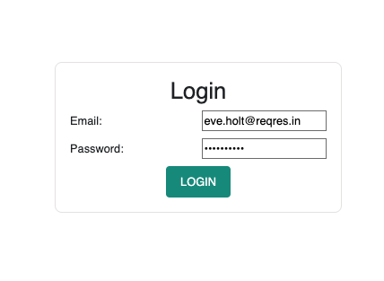
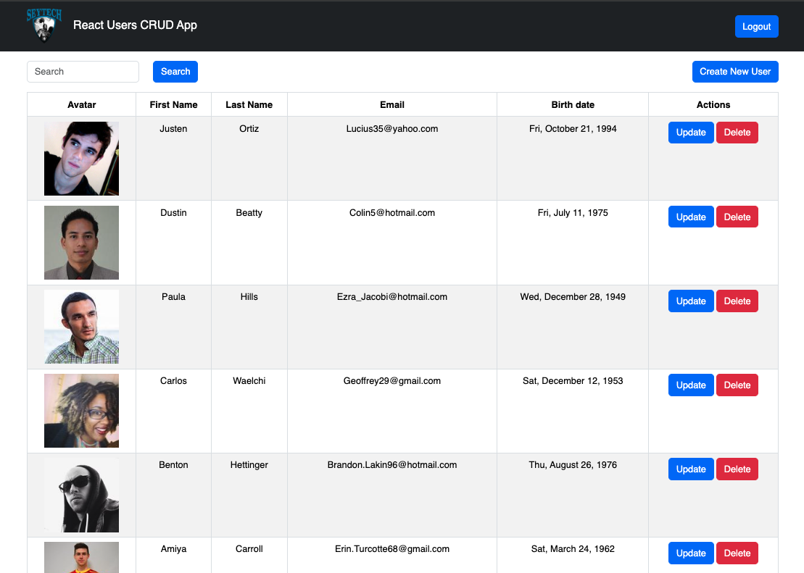
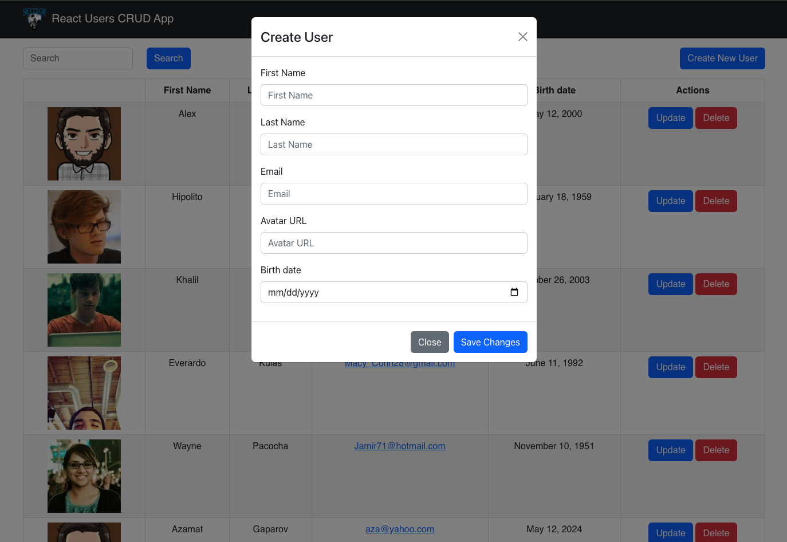
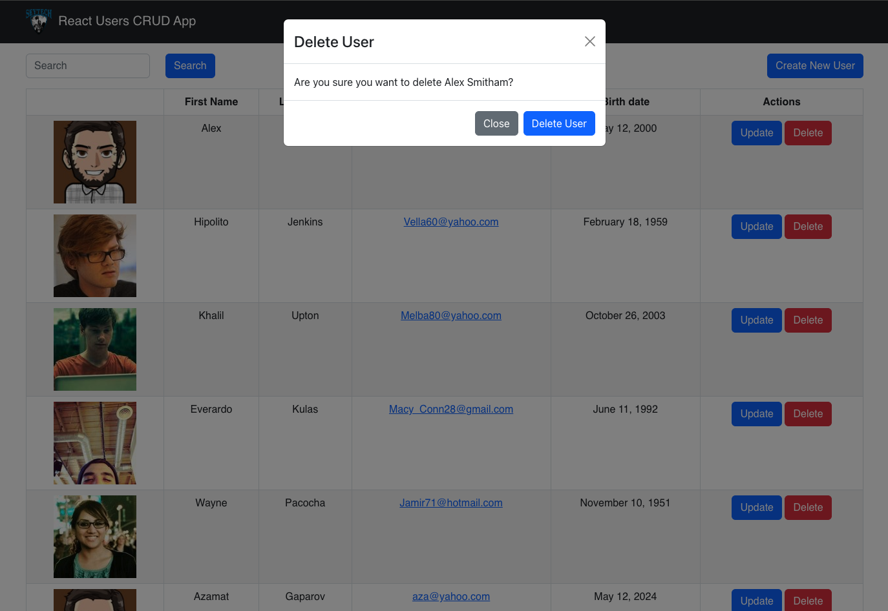

# React Users CRUD App Demo with Login Page

- This project is not completed, students will finish as a team.

- Deployed demo UI can be viewed here: https://wretched-harbor.surge.sh/

- Refer to this article to deploy a React App using `surge` and `github pages` [Link](https://www.freecodecamp.org/news/surge-vs-github-pages-deploying-a-create-react-app-project-c0ecbf317089):

## Available scripts to run this project

- Git clone the project to your local machine/laptop.
- Go into the project directory.
- In the project directory, you can run:

### `npm install`

### `npm run dev`

Runs the app in the development mode.\
Open [http://localhost:5174](http://localhost:5174) to view it in your browser.

The page will reload when you make changes.\
You may also see any lint errors in the console.

### UI views

### Login Page

### Initial View after logging in

### Create New User (expected after finish)

### Update User (expected after finish)

### Delete User (expected after finish)

